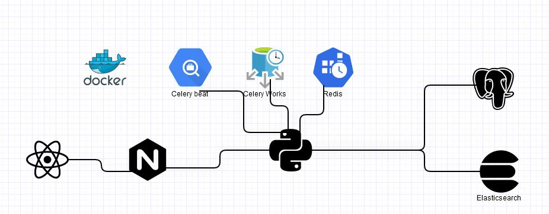

# Project Cities 
> Project that indexes a CSV file to PostgreSQL and Elasticsearch. A view was also generated in React.js and in the Django Templates.

* Used tools
    * Python
    * postgreSQL
    * ElasticSearch
    * React.js
    * Celery
    * Nginx
    * Docker




## Installation guide

Start cloning the repository:

```sh
 git clone https://github.com/Jairo852016/Cities

```

Enter the Cities folder, we build the containers and they are uploaded

```sh
 cd Cities
 docker-compose -f docker-compose.yml up -d --build

```

Run the Docker ps command and validate that the containers are up

```sh
    docker ps

```
To validate that the database was migrated, execute the following command and we execute an SQL statement to see the structure of the table

```sh
     docker-compose exec database psql cities -U jairo

     SELECT * FROM cities_cities;

```

Now we create the elasticsearch index

```sh
     docker-compose exec django python manage.py create_index

```
We create the super user of the Django administration and validate by entering the administration page http://localhost:8003/admin/.
Here you can review all the models exposed in Django

```sh
    docker-compose exec django python manage.py createsuperuser

```

To perform the data load we enter the following url.
```sh
    http://localhost:8003/upload/

```
We enter the data in the csv data model and the data begins to be registered in the database, validating by the name of the city.

after finishing the load in the database, start with the indexing in Elasticsearch

To start validating the searches can be seen at the following address

```sh
    http://localhost:8003/busqueda

```
To review the paginated data return you can enter the following url

```sh
    http://localhost:8003/api/v1/cities/pg-citiespag

```

It can be seen in the response that sends the data with the field of the next and the previous

```sh
   http://localhost:8003/api/v1/cities/pg-citiespag/?page=2

```


## Project Organization
    
    
    └──
        ├── docker-compose.yml
        ├── README.md 
        └──client
        │   ├── package-lock.json
        │   ├── package.json
        │   ├── Dockerfile
        │   ├── .dockerignore
        │   └── src
        │       ├── components   
        │       │   ├── Bootstrapb1.js
        │       │   ├── ResulList.js
        │       │   └── Search.js
        │       ├── App.js
        │       ├── App.test.js
        │       ├── index.css
        │       ├── index.js
        │       └── log.svg
        └──reverse-proxy
        │   ├── Dockerfile
        │   └── nginx.conf
        └── server
            ├── .dockerignore
            ├── Dockerfile
            ├── cities
            │   ├── data
            │   ├── fixtures        
            │   │   └── test_citie.json
            │   ├── management   
            │   │   └── commands
            │   │       ├── __init__.py
            │   │       ├── bulk_update.py
            │   │       ├── create_index.py
            │   │       └── elasticsearch.py
            │   ├── __init__.py
            │   ├── admin.py
            │   ├── constants.py
            │   ├── pagination.py
            │   ├── apps.py
            │   ├── filter.py
            │   ├── data
            │   │   └── cities1.json
            │   ├── migrations
            │   │   ├── 0001_initial.py
            │   │   └── __init__.py
            │   ├── models.py
            │   ├── serializers.py
            │   ├── tests
            │   │   ├── __init__.py
            │   │   └── test_views.py
            │   ├── task
            │   │   ├── __init__.py
            │   │   ├── celery.py
            │   │   └── task.py
            │   ├── templates
            │   │   └── cities
            │   │       └── upload.html
            │   ├── urls.py
            │   └── views.py
            ├── manage.py
            ├── media
            ├── static
            ├── search_cities
            │   ├── __init__.py
            │   ├── asgi.py
            │   ├── settings.py
            │   ├── urls.py
            │   └── wsgi.py
            ├── requirements.txt
            ├── beat.sh
            ├── flower.sh
            ├── worker.sh
            └── start.sh

## Contact

Jairo Pérez – [@TuTwitter](https://twitter.com/jairo85cd1) 

[https://github.com/Jairo852016/Citie](https://github.com/Jairo852016/Cities)

[https://www.linkedin.com/in/jairo-perez-502211102/](https://www.linkedin.com/in/jairo-perez-502211102/)
